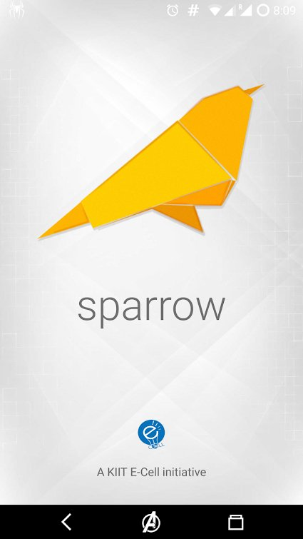

# Sparrow Android Newsfeed Project

Sparrow is a platform which tends to connect startups with mentors so that queries can be resolved during the development phase. It also useful for people who are currently in the Ideation Stage or who have the Entrepreneural spirit in them.

## ScreenShots

 

#### [Download APK](demo.apk)

#### [Play Store](https://play.google.com/store/apps/details?id=com.kodexlabs.sparrow)

## Project Experience

I created this app to help startups and entrepreneurs to stay updated with lates relevant newsfeed and connect with mentors. This app is written in java, xml, php(web apis) with help of firebase database, firebase push messaging, retrofit, gson, and many other third parties techs. Its a super simple app made to deliver important updates.

#### Features:-
	-Realtime live database connection
	-Firebase push notifications
	-Lazy load image loading
	-Beutiful UI